# PROJECT BLUEPRINT: IDX Disclosure Intelligence Pipeline

## 1. Global Context & Objective

Sistem ini adalah pipeline intelijen pasar modal otomatis yang memantau keterbukaan informasi emiten di Bursa Efek Indonesia (IDX). Tujuan utama: menyaring 80% noise administratif tanpa biaya komputasi, menganalisis dampak finansial/regulasi/GCG, dan memproduksi draf konten publik (X dan Threads) serta alert instan ke Telegram.

**Target lingkungan Fase 1 (Offline MVP):** Laptop Intel Core i3-1215U, RAM 5GB, runtime Python <100MB, tanpa OCR lokal, browser ephemeral maksimal 2–4 detik.

**Target lingkungan Fase 2 (Cloud 24/7):** GitHub Actions stateless cron + Turso Cloud SQLite.

## 2. System Architecture & Flow

### 2.1 Diagram Mermaid

```mermaid
flowchart LR
    A[GitHub Actions / Local Cron] --> B[Fetch Engine<br/>Playwright 2-4s -> cookie<br/>curl_cffi chrome124]
    B --> C[(SQLite/Turso<br/>idx_watcher.db)]
    C --> D[Stage-1 Filter<br/>Regex Blacklist/Whitelist]
    D -->|DROP| C
    D -->|AMBIGUOUS| E[TRIAGE LLM<br/>Role-1]
    E -->|urgency < 3| C
    E -->|urgency >= 3| F[PDF Stream Download<br/>PyMuPDF in-memory]
    F --> G{Text Extracted?}
    G -->|scan/no text| H[Cloud Vision API<br/>buffer image]
    G -->|yes| I[REASONER LLM<br/>Role-2]
    H --> I
    I --> J[(extracted_data<br/>financial_analysis<br/>drafts)]
    J --> K[Telegram Notifier<br/>Inline Keyboard]
```



### 2.2 Diagram ASCII

```text
@PROJECT_BLUEPRINT.md

+-------------------+      +---------------------------+
|  Trigger (cron)   |----->|  Hybrid Fetch Engine       |
+-------------------+      |  - playwright 2-4 detik    |
                           |  - curl_cffi impersonate   |
                           +------------+--------------+
                                        |
                                        v
+-------------------------------------------------------+
|                SQLite / Turso Cloud                   |
|  disclosures(id, title, emiten, status, payloads)     |
+-------------------------------------------------------+
        |  Stage-1 Regex
        v
+-------------------------------------------------------+
|  BLACKLIST -> DROPPED (0 cost)                        |
|  WHITELIST -> LANGSUNG DOWNLOAD PDF                   |
|  AMBIGUOUS -> Role-1 Triage                           |
+-------------------------------------------------------+
        |
        v
+-------------------------------------------------------+
|  Role-1: Gemini/Claude/Qwen (TRIAGE & VISION)         |
|  Output: urgency_score 1-5, is_material bool          |
|  Fallback: cloud vision utk PDF scan                  |
+-------------------------------------------------------+
        |
        v
+-------------------------------------------------------+
|  Role-2: DeepSeek/GPT/Claude (EXTRACT + ANALYZE +     |
|  WRITE)                                               |
|  Output: JSON skema Pydantic (data + analisis +       |
|  drafts X/Threads)                                    |
+-------------------------------------------------------+
        |
        v
+-------------------------------------------------------+
|  Telegram Bot (auth_guard) -> Notifikasi + Button     |
+-------------------------------------------------------+
```

## 3. Tech Specs & Trade-offs

### 3.1 Runtime & Memory
- Python 3.11+.
- Seluruh operasi streaming: PDF dibaca via `fitz.open(stream=..., filetype="pdf")`, tidak ada file PDF permanen di disk.
- Batas PDF: 20MB.
- Chromium hanya di-spawn 2–4 detik per siklus untuk menangkap `cf_clearance` & `__cf_bm`, lalu `browser.close()`. Tidak ada daemon browser.

### 3.2 Hybrid Fetch (Terverifikasi 200 OK)
- `playwright` Chromium headless dengan `--disable-blink-features=AutomationControlled` + script `navigator.webdriver` removal.
- Simpan cookies ke memori, langsung gunakan `curl_cffi` dengan `impersonate="chrome124"`.
- Jika gagal 3x berturut-turut: inisialisasi ulang handshake setelah backoff 60 detik.

### 3.3 LLM Model-Agnostic
- Menggunakan pola OpenAI-Compatible Client (via `httpx`/`litellm` wrapper).
- Tidak ada nama model hardcoded. Semua mapping didefinisikan di `.env`:

```text
@PROJECT_BLUEPRINT.md

# Role 1: Triage & Vision
TRIAGE_BASE_URL=https://api.openai.com/v1
TRIAGE_API_KEY=sk-...
TRIAGE_MODEL_NAME=gpt-4o-mini
TRIAGE_VISION_MODEL_NAME=gpt-4o-mini   # untuk PDF scan fallback

# Role 2: Extractor, Reasoner & Writer
REASONER_BASE_URL=https://api.deepseek.com/v1
REASONER_API_KEY=sk-...
REASONER_MODEL_NAME=deepseek-chat

# Optional Role 3: Long-doc Summarizer (future)
# WRITER_BASE_URL=...
# WRITER_API_KEY=...
# WRITER_MODEL_NAME=...
```

### 3.4 Database (SQLite/Turso DDL)

```text
@PROJECT_BLUEPRINT.md

CREATE TABLE IF NOT EXISTS disclosures (
    id TEXT PRIMARY KEY,               -- Id2 dari IDX
    emiten_code TEXT NOT NULL,
    title TEXT NOT NULL,
    release_date DATETIME,
    filter_status TEXT NOT NULL DEFAULT 'PENDING_FILTER',
    urgency_score INTEGER,
    is_material BOOLEAN DEFAULT 0,
    extracted_data TEXT,               -- JSON
    financial_analysis TEXT,           -- JSON
    draft_x TEXT,                      -- JSON
    draft_threads TEXT,                -- JSON
    is_sent_to_telegram BOOLEAN DEFAULT 0,
    created_at DATETIME DEFAULT CURRENT_TIMESTAMP,
    updated_at DATETIME
);
CREATE INDEX IF NOT EXISTS idx_filter_status ON disclosures(filter_status);
CREATE INDEX IF NOT EXISTS idx_release_date ON disclosures(release_date);
CREATE INDEX IF NOT EXISTS idx_emiten ON disclosures(emiten_code);
```

### 3.5 State Machine (`filter_status`)

```text
@PROJECT_BLUEPRINT.md

PENDING_FILTER --> DROPPED
PENDING_FILTER --> TRIAGED
PENDING_FILTER --> ANALYZED     (langsung dari whitelist)
TRIAGED       --> DROPPED
TRIAGED       --> ANALYZED
ANALYZED      --> NEEDS_MANUAL_REVIEW
ANALYZED      --> FAILED
```

## 4. Roadmap & Phases

### Phase 0: Project Setup & Dependencies
- Struktur direktori `src/`.
- `pyproject.toml`, `.env.example`, `settings.py`.
- Setup SQLite local, file `mock_disclosures.json`.

### Phase 1: Offline MVP
- Implementasi Hybrid Fetch Engine.
- Implementasi Stage-1 Regex Filter.
- Implementasi Role-1 Triage + Vision Fallback.
- Implementasi Role-2 Extract/Reason/Write.
- Implementasi Telegram Notifier + Auth Guard.
- Integration test end-to-end.

### Phase 2: Cloud Deployment (24/7)
- Pindah ke Turso Cloud SQLite.
- Setup GitHub Actions workflow stateless cron.
- Migrasi `.env` ke GitHub Secrets.
- Monitoring & logging terpusat.

### Phase 3: Modular Expansion (Opsional, Tidak Dieksekusi Sekarang)
- Aktifkan Role-3 (Long-doc Summarizer) via `.env`.
- Multi-account alerting.
- Dashboard web pemantauan.

## 5. Execution Checklist & Cline Prompts

Catatan: Semua task di bawah masih PENDING (`- [ ]`).

### Phase 0: Setup

- `[x]` T0.1: Inisialisasi struktur direktori proyek, `pyproject.toml`, dan dependencies (`curl_cffi`, `playwright`, `fitz`, `pydantic-settings`, `httpx`, `python-dotenv`, `aiosqlite`).
- `[x]` T0.2: Buat file `.env.example` berisi placeholder `TRIAGE_*`, `REASONER_*`, `TELEGRAM_BOT_TOKEN`, `ALLOWED_TELEGRAM_USER_ID`, `DATABASE_URL`.
- `[x]` T0.3: Implementasi `settings.py` menggunakan `pydantic-settings`.
- `[x]` T0.4: Buat `mock_disclosures.json` minimal 5 sampel pengumuman untuk offline testing.

### Phase 1: Offline MVP

- `[x]` T1.1: Implementasi Hybrid Fetch Engine.
- `[x]` T1.2: Implementasi Stage-1 Regex Filter.
- `[x]` T1.3: Implementasi LLM Client Factory (OpenAI-compatible).
- `[x]` T1.4: Implementasi Role-1 Prompt + Pydantic Schema.
- `[x]` T1.5: Implementasi Role-2 Prompt + Pydantic Schema.
- `[x]` T1.6: Implementasi PDF Stream Extractor dan fallback Cloud Vision.
- `[x]` T1.7: Implementasi Telegram Command Center + Auth Guard.
- `[x]` T1.8: Integration test end-to-end dengan `mock_disclosures.json`.

### Phase 2: Cloud Deployment

- `[x]` T2.1: Migrasi database ke Turso Cloud.
- `[x]` T2.2: Setup GitHub Actions workflow (schedule cron jam bursa).
- `[x]` T2.3: Implementasi `libsql` client wrapper untuk Turso.
- `[x]` T2.4: Konfigurasi logging terpusat.

### Phase 3: Modular Expansion (Future)

- `[ ]` T3.1: Aktifkan optional `WRITER_*` module (Role-3).
- `[ ]` T3.2: Implementasi dashboard monitoring sederhana.

---

### Cline Prompts

**T0.1: Setup struktur proyek**

```text
@PROJECT_BLUEPRINT.md
Buat struktur direktori src/{config,core,modules/filter,modules/extractor,modules/analysis,modules/generator,notifier} dan pyproject.toml dengan dependencies: curl_cffi, playwright, pymupdf, pydantic-settings, httpx, python-dotenv, aiosqlite, litellm. Jangan buat file lain.
Setelah selesai mengimplementasikan dan memverifikasi kode berjalan tanpa error, buka `@PROJECT_BLUEPRINT.md` lalu ubah status checklist task terkait dari `- [ ]` menjadi `- [x]`.
```

**T0.2: .env.example**

```text
@PROJECT_BLUEPRINT.md
Buat file .env.example berisi: TRIAGE_BASE_URL, TRIAGE_API_KEY, TRIAGE_MODEL_NAME, TRIAGE_VISION_MODEL_NAME, REASONER_BASE_URL, REASONER_API_KEY, REASONER_MODEL_NAME, TELEGRAM_BOT_TOKEN, TELEGRAM_CHAT_ID, ALLOWED_TELEGRAM_USER_ID, DATABASE_URL. Semua nilai placeholder kosong.
Setelah selesai mengimplementasikan dan memverifikasi kode berjalan tanpa error, buka `@PROJECT_BLUEPRINT.md` lalu ubah status checklist task terkait dari `- [ ]` menjadi `- [x]`.
```

**T0.3: settings.py**

```text
@PROJECT_BLUEPRINT.md
Buat src/config/settings.py menggunakan pydantic-settings. Baca seluruh variabel dari .env, beri tipe Field() dan validasi minimal. Ekspor instance global settings. Verifikasi dengan perintah: python -c "from config.settings import settings; print(settings.TRIAGE_API_KEY)".
Setelah selesai mengimplementasikan dan memverifikasi kode berjalan tanpa error, buka `@PROJECT_BLUEPRINT.md` lalu ubah status checklist task terkait dari `- [ ]` menjadi `- [x]`.
```

**T0.4: Mock data**

```text
@PROJECT_BLUEPRINT.md
Buat src/data/mock_disclosures.json berisi 5 objek dengan field: Id2, emiten_code, title, release_date, FullSavePath (URL dummy .pdf). Gunakan judul campuran: 1 transaksi material, 1 pembelian kembali saham, 1 laporan harian NAB (harus di-drop), 1 penjelasan atas pemberitaan, 1 pengunduran diri direksi. Validasi JSON.
Setelah selesai mengimplementasikan dan memverifikasi kode berjalan tanpa error, buka `@PROJECT_BLUEPRINT.md` lalu ubah status checklist task terkait dari `- [ ]` menjadi `- [x]`.
```

**T1.1: Hybrid Fetch Engine**

```text
@PROJECT_BLUEPRINT.md
Buat src/core/fetcher.py berisi fungsi fetch_announcements(date_to: str) -> list. Implementasi: playwright chromium buka halaman IDX 2 detik, ambil cookies cf_clearance dan __cf_bm, tutup browser, lalu curl_cffi dengan impersonate="chrome124" request ke https://www.idx.co.id/primary/ListedCompany/GetAnnouncement?kodeEmiten=&emitenType=*&indexFrom=1&pageSize=10&dateFrom=19010101&dateTo={date_to}&lang=id&keyword=. Return parsed JSON items. Sertakan retry 3x dengan exponential backoff. Verifikasi dengan panggilan live sekali.
Setelah selesai mengimplementasikan dan memverifikasi kode berjalan tanpa error, buka `@PROJECT_BLUEPRINT.md` lalu ubah status checklist task terkait dari `- [ ]` menjadi `- [x]`.
```

**T1.2: Stage-1 Regex Filter**

```text
@PROJECT_BLUEPRINT.md
Buat src/modules/filter/stage1_regex.py berisi BLACKLIST_PATTERNS dan WHITELIST_PATTERNS. Fungsi classify(title: str) -> Literal["DROP","PASS","AMBIGUOUS"]. Blacklist: laporan harian NAB, registrasi pemegang efek, bukti iklan. Whitelist: transaksi material, transaksi afiliasi, benturan kepentingan, PKPU, akuisisi, buyback, pengunduran diri akuntan. Buat unittest untuk 5 kasus.
Setelah selesai mengimplementasikan dan memverifikasi kode berjalan tanpa error, buka `@PROJECT_BLUEPRINT.md` lalu ubah status checklist task terkait dari `- [ ]` menjadi `- [x]`.
```

**T1.3: LLM Client Factory**

```text
@PROJECT_BLUEPRINT.md
Buat src/core/llm_client.py dengan class LLMClient. Inisialisasi dari settings: base_url, api_key, model_name. Beri metode chat_json(system_prompt, user_prompt, response_format: BaseModel) -> BaseModel menggunakan httpx ke endpoint /chat/completions dengan response_format json_schema. Sertakan timeout 120 detik dan retry 2x. Verifikasi dengan panggilan yang outputnya divalidasi pydantic.
Setelah selesai mengimplementasikan dan memverifikasi kode berjalan tanpa error, buka `@PROJECT_BLUEPRINT.md` lalu ubah status checklist task terkait dari `- [ ]` menjadi `- [x]`.
```

**T1.4: Role-1 Triage + Schema**

```text
@PROJECT_BLUEPRINT.md
Buat src/modules/filter/triage.py berisi Pydantic model TriageOutput(urgency_score: int 1-5, is_material: bool, reasoning: str) dan fungsi triage_ambiguous(title, body_preview) yang memanggil LLMClient dengan system prompt "Anda analis pasar modal. Klasifikasikan urgensi dan materialitas pengumuman IDX. Skor 1-5." dan user prompt berisi judul + teks singkat. Verifikasi dengan mock LLM.
Setelah selesai mengimplementasikan dan memverifikasi kode berjalan tanpa error, buka `@PROJECT_BLUEPRINT.md` lalu ubah status checklist task terkait dari `- [ ]` menjadi `- [x]`.
```

**T1.5: Role-2 Extract + Analyze + Write**

```text
@PROJECT_BLUEPRINT.md
Buat src/modules/analysis/role2.py berisi 3 Pydantic model: ExtractedData, FinancialAnalysis, DraftOutput. ExtractedData berisi field transaksi_nilai, pihak_terafiliasi, tanggal, deskripsi_singkat, dsb. FinancialAnalysis berisi rasio_materialitas, kategori_pojk17, risiko_likuiditas, catatan_gcg. DraftOutput berisi summary_pribadi, draft_x (list string utas), draft_threads (list string). Fungsi analyze_document(pdf_text) memanggil LLMClient dengan satu prompt menggabungkan ekstraksi, analisis, dan penulisan draf, lalu mengembalikan gabungan ketiga model dalam satu dict. Verifikasi dengan input teks dummy.
Setelah selesai mengimplementasikan dan memverifikasi kode berjalan tanpa error, buka `@PROJECT_BLUEPRINT.md` lalu ubah status checklist task terkait dari `- [ ]` menjadi `- [x]`.
```

**T1.6: PDF Extractor + Vision Fallback**

```text
@PROJECT_BLUEPRINT.md
Buat src/modules/extractor/pdf_parser.py berisi fungsi extract_text_from_url(url) -> str yang download PDF ke memory via httpx, buka dengan fitz.open(stream=...), ekstrak teks per halaman. Jika total char per halaman < 100, render page.get_pixmap() ke buffer JPEG, kirim ke vision via TRIAGE_VISION_MODEL_NAME, minta transkripsi teks. Return teks gabungan. Batasi 20MB. Jangan simpan file di disk.
Setelah selesai mengimplementasikan dan memverifikasi kode berjalan tanpa error, buka `@PROJECT_BLUEPRINT.md` lalu ubah status checklist task terkait dari `- [ ]` menjadi `- [x]`.
```

**T1.7: Telegram Command Center**

```text
@PROJECT_BLUEPRINT.md
Buat src/notifier/telegram_bot.py. Gunakan raw HTTP polling ke api.telegram.org (tanpa library berat) dengan auth_guard: abaikan update dari user selain ALLOWED_TELEGRAM_USER_ID. Kirim pesan berisi emiten, judul, urgency_score, is_material, dan inline keyboard: "Draft X", "Draft Threads", "Detail Analisa", "Dismiss". Handler tombol mengirim draft sesuai payload dari database. Verifikasi dengan kirim pesan manual via bot.
Setelah selesai mengimplementasikan dan memverifikasi kode berjalan tanpa error, buka `@PROJECT_BLUEPRINT.md` lalu ubah status checklist task terkait dari `- [ ]` menjadi `- [x]`.
```

**T1.8: Integration Test E2E**

```text
@PROJECT_BLUEPRINT.md
Buat script src/main.py yang membaca mock_disclosures.json, menjalankan seluruh pipeline: fetch -> status PENDING -> stage1 filter -> ambigous ke triage -> whitelist langsung download pdf -> role2 analyze -> simpan ke database -> kirim notifikasi telegram. Pastikan tidak ada error dan database terisi.
Setelah selesai mengimplementasikan dan memverifikasi kode berjalan tanpa error, buka `@PROJECT_BLUEPRINT.md` lalu ubah status checklist task terkait dari `- [ ]` menjadi `- [x]`.
```

**T2.1: Migrasi Turso**

```text
@PROJECT_BLUEPRINT.md
Ubah DATABASE_URL di settings.py agar mendukung libsql: URL format libsql://... dan install dependency libsql-experimental. Tambahkan wrapper async di src/core/db.py yang memilih sqlite lokal atau turso berdasarkan DATABASE_URL. Jalankan migrasi sederhana (buat tabel) dan verifikasi koneksi.
Setelah selesai mengimplementasikan dan memverifikasi kode berjalan tanpa error, buka `@PROJECT_BLUEPRINT.md` lalu ubah status checklist task terkait dari `- [ ]` menjadi `- [x]`.
```

**T2.2: GitHub Actions Workflow**

```text
@PROJECT_BLUEPRINT.md
Buat .github/workflows/pipeline.yml dengan trigger schedule cron "*/15 1-8 * * 1-5" (jam bursa WIB dikonversi UTC) dan workflow_dispatch. Job menjalankan checkout, setup python, pip install, playwright install chromium, lalu python src/main.py. Semua secrets diakses dari github secrets. Batasi concurrency agar tidak dobel run.
Setelah selesai mengimplementasikan dan memverifikasi kode berjalan tanpa error, buka `@PROJECT_BLUEPRINT.md` lalu ubah status checklist task terkait dari `- [ ]` menjadi `- [x]`.
```

**T2.3: Logging Terpusat**

```text
@PROJECT_BLUEPRINT.md
Tambahkan src/core/logger.py dengan format JSON logs ke stdout. Include timestamp, level, module, filter_status, duration_ms. Semua modul wajib import logger ini. Verifikasi dengan menjalankan main.py dan melihat output JSON di terminal.
Setelah selesai mengimplementasikan dan memverifikasi kode berjalan tanpa error, buka `@PROJECT_BLUEPRINT.md` lalu ubah status checklist task terkait dari `- [ ]` menjadi `- [x]`.
```

## 6. Change History

| Tanggal | Versi | Perubahan |
|---------|-------|-----------|
| 2025-07-09 | v1.0 | Inisialisasi blueprint. Endpoint IDX terverifikasi 200 OK. Arsitektur model-agnostic via `.env`. Scope MVP dibatasi ke Dual-Role (Triage + Reasoner). Semua task masih pending. |
| 2026-08-20 | v1.1 | Perkuat anti-WAF IDX: Playwright launch args anti-detection + stealth headers + navigator.webdriver masking + locale/timezone; samakan header USER_AGENT/Referer pada curl_cffi API & PDF download; backoff bertahap 3s/6s/9s saat 403. |
| 2026-08-20 | v1.2 | Ubah strategi pengambilan data ke In-Browser Fetch: fetch announcement via `page.evaluate` langsung dari context Chromium (bypass WAF 403 200 OK, 20 item); PDF download fallback via in-page `page.evaluate` arraybuffer→base64 setelah curl_cffi 403x3 (bypass 403, terverifikasi 9371 bytes). `context.request.get` tetap 403 → ganti in-page fetch. |
| 2026-08-20 | v1.3 | Refactor `src/core/fetcher.py` ke Playwright Network Response Interception: `page.on("response")` menangkap JSON `ListedCompany/GetAnnouncement` resmi; ganti `wait_until="networkidle"` (tak pernah settle → timeout) ke `domcontentloaded` + trigger in-page fetch fallback. Verifikasi pipeline local: 20 item intercepted attempt 1, PDF browser fallback 7283/9371/9127 bytes, 3 announcement terkirim ke Telegram. Commit `7897c1d`. |
| 2026-08-20 | v1.4 | Integrasi `playwright-stealth` (`Stealth().apply_stealth_async`) untuk evasi deteksi headless: masking CDP, WebGL, navigator, plugins via `add_init_script` otomatis; dipasang di `src/core/fetcher.py` (sebelum intercept) dan fallback PDF `src/modules/extractor/pdf_parser.py` (sebelum navigasi). Header ekstra `Sec-Ch-Ua` ditambahkan. Commit `05f93fa`. |
